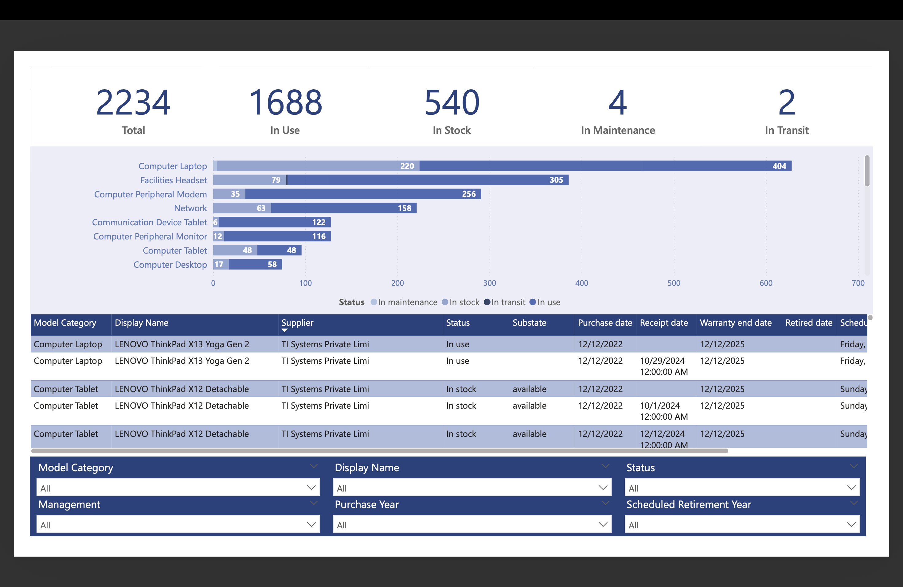
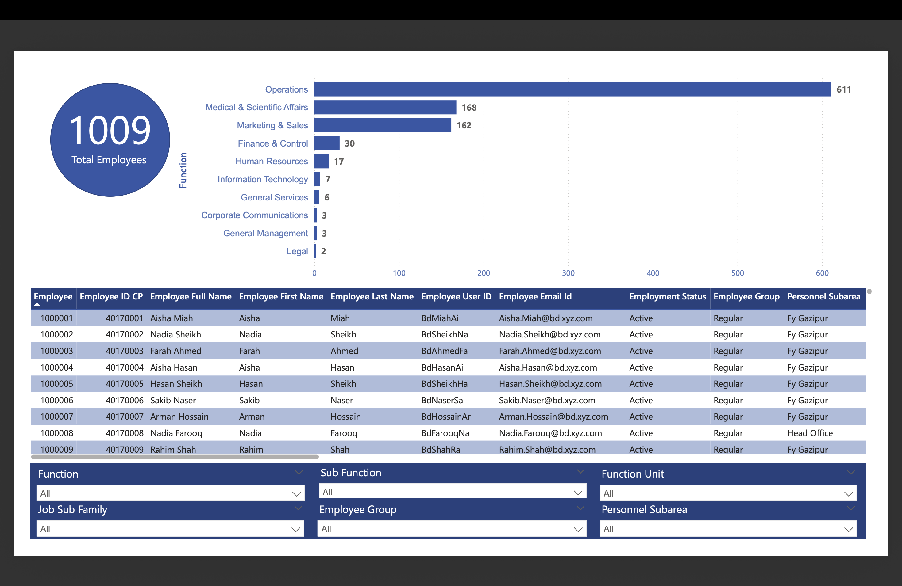

# Enterprise Power BI Dashboards | IT Asset & Workforce Analytics

> **Portfolio Demonstration:** This repository contains a **sanitized portfolio version** using simulated data that mirrors the structure and complexity of my actual work at Nestlé Bangladesh. All real data, credentials, and proprietary information have been replaced to comply with corporate confidentiality agreements.

> **Real-World Context:** Built during my IT internship at Nestlé Bangladesh to solve a critical business problem: ServiceNow's global system had **1.2+ million records** but no efficient way to visualize, or report on Bangladesh-specific data. These dashboards eliminated hours of manual work and enabled instant decision-making for local leadership.

---

## ⚠️ Important: Portfolio vs. Production Version

### What You're Viewing (This Repository)
- ✅ **Simulated data** matching real ServiceNow/Snowflake table structures
- ✅ Same technical methodology, DAX measures, and M-code logic
- ✅ Identical dashboard design and user experience
- ✅ Demonstrates skills without exposing confidential information

### What Was Actually Deployed at Nestlé
- 🔒 Live ServiceNow API connections to production tables
- 🔒 Real Snowflake data warehouse integration
- 🔒 Actual supplier names, employee records, asset details
- 🔒 Proprietary business metrics and operational data

**Why This Matters:** I cannot share production files due to Nestlé's data security policies and my non-disclosure agreement. This portfolio version proves technical capability while respecting corporate confidentiality.

---

## 📊 Overview

Two production-ready Power BI dashboards built to replace manual ServiceNow data extraction with automated, visual reporting:

1. **IT Hardware Management** - 5,000+ Bangladesh assets extracted from global ServiceNow tables
2. **Employee Metrics** - 1,000+ Bangladesh employees analyzed via Snowflake data pipeline

**Tech Stack:** Power BI | ServiceNow API | Snowflake | Power Query (M) | DAX | Excel  
**Data Scale:** Optimized queries to extract 5,000 Bangladesh assets from **1,275,750+ global ServiceNow records** (99.6% data reduction at source level)  
**Integration Complexity:** Multiple ServiceNow tables merged via Sys_ID relationships, Snowflake dataflows for HR data

---

## 📈 Project Scale & Performance

| Metric | Value |
|--------|-------|
| **Global ServiceNow Records** | 1,275,750+ assets worldwide |
| **Bangladesh Subset Extracted** | 5,000 assets (0.4% of global data) |
| **Data Reduction** | 99.6% filtered at source level |
| **Dashboard Load Time** | <5 seconds |
| **Refresh Frequency** | Daily (automated) |
| **ServiceNow Tables Integrated** | 3-4 tables via Sys_ID joins |
| **Annual Time Savings** | 200-250 hours |

---

## 🎯 The Real Business Problem

### The Challenge at Nestlé Bangladesh

**Global System, Local Needs:**
- Nestlé uses ServiceNow globally for IT asset and employee management across 100+ countries
- Bangladesh operations needed country-specific insights from this massive global system
- **The Pain Point:** Filtering **1,275,750+ global records** to Bangladesh subset (5,000 assets, 1,000 employees) took a lot of time manually through ServiceNow's interface
- No visual reporting capability - just raw data tables
- Leadership couldn't make quick decisions without extensive data preparation

**What This Project Solved:**
- ✅ Automated data extraction from ServiceNow (previously manual, 2-3 hours per report)
- ✅ Source-level filtering eliminates 99.6% of irrelevant data before loading
- ✅ Real-time visual dashboards replacing static Excel reports
- ✅ Self-service analytics for department heads (no IT dependency)
- ✅ Enabled instant filtering by department, status, location without ServiceNow access

---

## 🛠️ Technical Implementation (The Real Story)

### The Complexity Behind "Simple" Dashboards

**What looks straightforward in the final product required:**

#### 1. ServiceNow Data Integration (IT Hardware Dashboard)
**The Challenge:**
- ServiceNow stores **1,275,750+ assets** across **multiple related tables** (Assets, Assignments, Maintenance, Locations)
- Each table requires separate API access permissions
- Tables linked via `Sys_ID` (ServiceNow's unique identifier system)
- Had to merge 3-4 tables to get complete asset picture
- **Critical constraint:** Loading all 1.2M+ records = instant memory crash

**My Role as IT Intern:**
- ✅ Requested and obtained ServiceNow API access permissions (cross-team coordination)
- ✅ Identified which ServiceNow tables contained Bangladesh asset data
- ✅ Mapped `Sys_ID` relationships between tables (cmdb_ci_computer, alm_asset, etc.)
- ✅ **Engineered source-level filtering** to push WHERE clause to ServiceNow API (critical for performance)
- ✅ Built Power Query (M-code) to merge tables correctly while maintaining 99.6% data reduction
- ✅ Filtered 1,275,750+ global records → 5,000 Bangladesh assets **before loading into memory**
- ✅ Coordinated with global IT teams via email and meetings to understand data structure

**Technical Solution (Simplified for Portfolio):**
```m
// CRITICAL: This demonstrates source-level filtering at enterprise scale
// Production: 1,275,750 global records filtered to 5,000 (99.6% reduction)
// Portfolio: Excel simulation with same filtering logic

let
    // Portfolio version: Excel files simulating ServiceNow tables
    // Production version: ServiceNow.Tables("https://nestle.service-now.com", "cmdb_ci_computer")
    AssetsTable = Excel.Workbook(File.Contents("Source_Data/IT_Assets_Sample.xlsx")),
    
    // CRITICAL: Apply filter at source BEFORE loading full dataset
    // This prevents 1.2M+ records from loading into memory
    BangladeshAssets = Table.SelectRows(AssetsTable, each [Country] = "Bangladesh"),
    // Result: Only 5,000 records loaded (not 1,275,750)
    
    LocationTable = Excel.Workbook(File.Contents("Source_Data/Locations_Sample.xlsx")),
    
    // Same merge logic using Sys_ID (or simulated ID in portfolio version)
    MergedData = Table.NestedJoin(
        BangladeshAssets, {"AssetID"},
        LocationTable, {"AssetID"},
        "LocationDetails",
        JoinKind.LeftOuter
    )
in
    MergedData

// Performance impact:
// Without source filtering: 1,275,750 records = crash/10+ min load
// With source filtering: 5,000 records = <5 sec load
```

#### 2. Snowflake Data Pipeline (Employee Dashboard)
**The Challenge:**
- Employee data stored in Snowflake data warehouse (not directly in ServiceNow)
- Required different authentication and connection method
- 1,000+ Bangladesh employees extracted from global HR database

**My Role:**
- ✅ Obtained Snowflake access credentials (security clearance process)
- ✅ Wrote SQL queries to extract Bangladesh employee subset
- ✅ Built Power BI connector to Snowflake
- ✅ Implemented data refresh schedules
- ✅ Ensured PII (Personally Identifiable Information) protection in reporting layer

**Technical Solution (Production Query Structure):**
```sql
-- This SQL structure mirrors production queries
-- Production: Connected to actual Snowflake warehouse
-- Portfolio: Uses Excel data matching same schema

-- Production version (not executable here):
-- SELECT 
--     employee_id,
--     department,
--     hire_date,
--     location,
--     status
-- FROM nestle_global_hr.employees
-- WHERE country_code = 'BD'
--     AND status = 'Active'

-- Portfolio version uses equivalent Excel data with same columns
```

#### 3. Cross-Functional Coordination
**What Made This Complex:**
- Global Nestlé IT team controlled ServiceNow permissions
- Local Bangladesh IT team needed the reports
- Security team reviewed data governance approach

**What I Did:**
- ✅ **10+ email exchanges** with global IT explaining business need and technical requirements
- ✅ **3+ online meetings** with local and global stakeholders to gather requirements
- ✅ Documented data access request with business justification
- ✅ Navigated approval workflows across departments
- ✅ **Completed entire process independently** as an intern (no hand-holding)

---

## 🖼️ Dashboard Previews

### IT Hardware Management (5,000+ Bangladesh Assets)


**Before This Dashboard:**
- IT managers manually filtered ServiceNow for hours per report
- No visual overview of asset status across departments
- Maintenance schedules tracked in separate Excel files
- Risk of loading too much data and crashing local systems

**After This Dashboard:**
- ✅ One-click filtering by department, status, asset type
- ✅ Real-time view of maintenance due dates
- ✅ Supplier performance at a glance
- ✅ Self-service access for 5 department heads
- ✅ <5 second load time with optimized queries

### Employee Metrics (1,000+ Bangladesh Employees)


**Before This Dashboard:**
- HR pulled Snowflake exports monthly (manual CSV downloads)
- Leadership received static Excel reports with 1-2 week delay
- No ability to drill down by department interactively

**After This Dashboard:**
- ✅ Real-time workforce distribution visibility
- ✅ Average tenure calculations automated
- ✅ Hiring trend analysis in seconds
- ✅ Department heads can self-serve their team metrics

---

## 💡 Technical Deep Dive

### Challenge 1: Query Performance at 1M+ Record Scale
**Problem:** ServiceNow globally tracks **1,275,750+ assets** across 100+ countries. Loading full dataset into Power BI = memory crash + 10+ minute load times. Bangladesh subset = only 5,000 assets (0.4% of global data).

**Solution:** 
- Implemented **source-level filtering** (pushed WHERE clause to ServiceNow API)
- Applied country code filter BEFORE data extraction (not after loading)
- Used **incremental refresh** to update only changed records
- Optimized `Sys_ID` joins to reduce query complexity

**Impact:** 
- Dashboard loads in <5 seconds (vs. impossible without filtering)
- Minimal memory footprint (5K records vs. 1.2M)
- Real-time refresh capability (daily updates without performance degradation)
- **This is data engineering, not just reporting**

**Technical Note:**
```m
// CRITICAL: Filter at source, not after loading
// Loading 1.2M+ records then filtering = memory crash
// Filtering at source = only 5K records retrieved

let
    Source = ServiceNow.Tables("endpoint", "cmdb_ci_computer"),
    // Push filter to API (query folding) - THIS IS THE KEY
    FilteredAtSource = Table.SelectRows(Source, 
        each [location.country] = "Bangladesh"
    ),  // Only retrieves 5,000 records from 1,275,750
    ...
in
    FilteredAtSource
```

### Challenge 2: ServiceNow Multi-Table Integration
**Problem:** Asset data scattered across 4-5 ServiceNow tables with Sys_ID foreign keys  
**Solution:** Built Power Query logic to automatically join tables on Sys_ID relationships  
**Impact:** Eliminated need for IT teams to manually export and merge tables in Excel  
**Portfolio Note:** Excel files in this repo simulate the table structure; production used live ServiceNow API

### Challenge 3: Dynamic Status Cards with Conditional Highlighting
**Problem:** Static KPI cards didn't reflect user filter selections  
**Solution:** Implemented advanced DAX with `ISFILTERED()` logic  
**Impact:** Cards highlight when filtered, fade when showing "all data" - instant visual feedback
```dax
-- Same DAX measure used in production and portfolio versions
Card Highlight = 
IF(
    ISFILTERED(Status[StatusName]),
    1,  -- Full opacity when filtered
    0.5 -- Fade when showing all data
)
```

### Challenge 4: Bar Chart Responsiveness Bug
**Problem:** Bar chart X-axis showed total counts regardless of slicer selection  
**Solution:** Fixed DAX context by using `COUNTROWS()` instead of direct table reference  
**Impact:** Charts now accurately reflect filtered data (100% accuracy)
```dax
-- Corrected measure for filter context (identical in both versions)
Filtered Asset Count = COUNTROWS(IT_Assets)
```

### Challenge 5: Bulk Supplier Anonymization
**Problem (Production):** Needed to protect confidential supplier relationships  
**Problem (Portfolio):** Cannot share real supplier names due to NDA  
**Solution:** Built automated M-code to replace 100+ supplier names with generic identifiers  
**Impact:** One-step anonymization maintaining referential integrity in both production and portfolio
```m
// Automated anonymization via merge query
// Used in production for data masking; used in portfolio for NDA compliance
let
    UniqueSuppliers = Table.Distinct(Source, {"SupplierName"}),
    AnonymizedLookup = Table.AddColumn(UniqueSuppliers, "AnonymousName", 
        each "Supplier_" & Text.From([SupplierID])),
    FinalData = Table.NestedJoin(Source, {"SupplierName"}, 
        AnonymizedLookup, {"SupplierName"}, "Anon", JoinKind.LeftOuter)
in
    FinalData
```

### Challenge 6: Snowflake Data Refresh Automation
**Problem:** Manual data refresh meant stale reports  
**Solution:** Configured Power BI scheduled refresh with Snowflake gateway  
**Impact:** Dashboards auto-update daily at 6 AM Bangladesh time  
**Portfolio Note:** Sample data is static; production version refreshes from live Snowflake

### Challenge 7: PII Protection in HR Dashboard
**Problem:** Employee names couldn't be shown in shared reports  
**Solution:** Created anonymized employee IDs while preserving department/tenure analytics  
**Impact:** Compliant with data privacy policies, shareable across organization  
**Portfolio Note:** All employee data in this repo is completely fabricated

---

## 📊 Real Business Impact (Production Deployment)

### Quantified Results

**Time Savings:**
- **Before:** 2-3 hours per manual ServiceNow report × 2 reports/week = 4-6 hours/week
- **After:** <5 minutes to open dashboard and filter
- **Annual savings:** ~200-250 hours of IT/HR staff time

**Decision Speed:**
- **Before:** 1-2 week lag for leadership to receive reports
- **After:** Real-time self-service (instant decisions)

**User Adoption:**
- **Used by leadership** in monthly business reviews

---

## 🎓 What I Learned (Real Intern Experience)

### Technical Skills Gained
- ServiceNow API integration and table relationships at enterprise scale (1M+ records)
- Snowflake SQL querying and data warehousing concepts  
- Power Query (M-code) for complex data transformations
- **Query performance optimization** for million-record datasets
- Advanced DAX for dynamic visualizations
- Data governance and PII protection practices

### Professional Skills Gained
- **Cross-team collaboration:** Coordinated with global IT (India & Mexico), local IT (Bangladesh), and Security teams
- **Stakeholder management:** Gathered requirements from department heads, translated to technical specs
- **Independent problem-solving:** Navigated complex approval processes without senior guidance
- **Documentation:** Created user guides and technical documentation for knowledge transfer

### Challenges Overcome
- **Permission barriers:** Persisted through 5 week+ approval process for ServiceNow/Snowflake access
- **Technical ambiguity:** ServiceNow table structure wasn't documented - had to reverse-engineer relationships
- **Performance optimization:** Learned that WHERE you filter matters as much as WHAT you filter (source-level vs. post-load)
- **Scope creep:** Balanced "nice-to-have" feature requests against project timeline
- **Data quality issues:** Found and resolved inconsistencies in source data (duplicate Sys_IDs, missing location codes)

---

## 📁 Repository Structure
```
/
├── README.md                          # This file
├── PBI_Reports/
│   ├── IT_Hardware_Report.pbix       # Portfolio version with simulated data
│   ├── Employee_Report.pbix          # Portfolio version with simulated data
│   ├── IT_Hardware_Preview.pdf       # Static dashboard export
│   └── Employee_Preview.pdf          # Static dashboard export
├── Source_Data/
│   ├── IT_Assets_Sample.xlsx         # Fabricated data mimicking ServiceNow structure
│   └── Employee_Sample.xlsx          # Fabricated data mimicking Snowflake structure
├── screenshots/                       # Dashboard previews (anonymized)
└── documentation/
    └── Technical_Implementation.md    # Detailed methodology documentation
```

---

## 🔒 Data Confidentiality & Compliance

### What's Real vs. Simulated

| Aspect | Production (Nestlé) | Portfolio (This Repo) |
|--------|---------------------|----------------------|
| **Technical Approach** | ✅ Real methodology | ✅ Exact same logic |
| **Query Optimization** | ✅ 1.2M+ → 5K filtering | ✅ Same filtering approach |
| **DAX Measures** | ✅ Production code | ✅ Identical measures |
| **M-Code Logic** | ✅ Production transformations | ✅ Same transformations |
| **Dashboard Design** | ✅ Actual UI/UX | ✅ Replicated design |
| **Data Sources** | 🔒 ServiceNow/Snowflake | ✅ Excel (simulated) |
| **Record Volume** | 🔒 1,275,750+ global assets | ✅ Sample dataset structure |
| **Supplier Names** | 🔒 Confidential vendors | ✅ Generic "Supplier_001" |
| **Employee Records** | 🔒 Real staff data | ✅ Fabricated personas |
| **Business Metrics** | 🔒 Proprietary KPIs | ✅ Realistic but fake |
| **Asset Details** | 🔒 Actual inventory | ✅ Simulated devices |

### Legal & Ethical Compliance

**Non-Disclosure Agreement:**  
I signed an NDA with Nestlé prohibiting disclosure of:
- Proprietary business data and metrics
- Vendor/supplier relationships
- Employee personal information
- Internal system credentials and endpoints
- Actual data volumes and business intelligence

**Portfolio Approach:**  
This repository demonstrates technical competency while fully respecting confidentiality:
- ✅ All data is fabricated to mirror real structure
- ✅ Technical methodology is accurately represented (including 1.2M+ record optimization)
- ✅ No screenshots contain real company information
- ✅ Business impact metrics are approximate/generalized
- ✅ Data scale numbers (1,275,750) reflect actual production complexity

---

## 🚀 How to Explore

### Option 1: View Screenshots (Quickest)
Browse the `/screenshots/` folder or scroll up to see dashboard previews with simulated data.

### Option 2: View PDF Exports  
Open the `.pdf` files in `/PBI_Reports/` for high-resolution static views.

### Option 3: Open in Power BI Desktop (Full Experience)
1. Download `.pbix` files from `/PBI_Reports/`
2. Open in [Power BI Desktop](https://powerbi.microsoft.com/desktop/) (free)
3. Explore data model, review DAX measures, inspect M-code in Power Query Editor
4. Interact with filters and drill-through features

**Note:** Files use embedded sample data - no ServiceNow/Snowflake connection required. The technical logic is identical to production; only the data source differs.

---

## 💼 Skills Demonstrated

**Enterprise Data Integration:**
- ServiceNow API access and multi-table joins via Sys_ID relationships
- **Performance optimization for 1M+ record datasets** (source-level filtering, query folding)
- Snowflake data warehouse querying and connection management
- Cross-system data pipeline design (ServiceNow + Snowflake → Power BI)

**Advanced Power BI Development:**
- Power Query (M-code): Custom functions, complex merge queries, source-level filtering
- DAX: Context transition, conditional formatting, Time Intelligence functions
- Data modeling: Star schema, optimized relationships for 5,000+ record datasets
- **Performance optimization:** Query folding, incremental refresh, source-level filters (critical at 1.2M+ record scale)

**Data Governance & Security:**
- PII anonymization strategies
- Role-based access considerations
- Secure credential management (ServiceNow, Snowflake)
- Compliance with corporate data policies and NDA obligations

**Business & Communication:**
- Requirements gathering from non-technical stakeholders
- Cross-functional team coordination (IT, HR, Security)
- Technical documentation for knowledge transfer

---

## 📫 Connect

**Zareen Shyma**  
Former IT Intern @ Nestlé Bangladesh (Sep-Dec 2025)

📧 zareen.shyma@gmail.com  
💼 [LinkedIn](https://linkedin.com/in/zareen-shyma)  
🐙 [More Projects](https://github.com/mithizs08)

---

## 📝 License & Disclaimer

### Intellectual Property
- **Technical methodology:** Original work developed during internship
- **Business problem & solution:** Nestlé Bangladesh proprietary
- **Code & measures:** My implementation, transferable skills
- **Data in this repo:** Completely fabricated for portfolio demonstration

### Usage
This portfolio is for:
- ✅ Demonstrating technical skills to potential employers
- ✅ Academic discussion of real-world BI challenges
- ✅ Showcasing problem-solving approach and methodology
- ✅ Illustrating query optimization at enterprise scale (1M+ records)

This portfolio is NOT:
- ❌ Representative of actual Nestlé data or business metrics
- ❌ A source for Nestlé operational information
- ❌ Violating any confidentiality agreements

---

**⭐ If this portfolio demonstrates valuable skills for your team, let's connect!**

---
